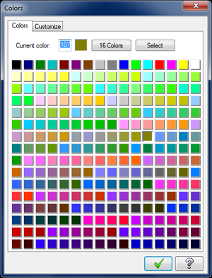
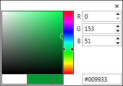

Mastercam-Color-Converter
============

Converts Mastercam color numbers to hex values for use in the new verify and backplot color picker.

## Description ##

[Mastercam](http://www.mastercam.com/en-us/ "Mastercam") is a CAD/CAM package that creates toolpaths to drive your CNC machines. The color picker in Mastercam consists of 256 colors that are identified by a number. Mastercam's color numbers are 0-255 and are arranged in order, from left to right, top to bottom. For example, 0 is black and 12 is red.

### Mastercam color picker ###

When Mastercam X7 was released, it introduced a new verify and backplot toolpath simulator. Unlike the existing color picker used in Mastercam, the new simulator uses a color picker that accepts hex values to define colors.
### New Color Picker ###

For those of us who have been using Mastercam for a while, we have colors that we like to use for certain things. Personally, I like my stock color to be #2 dark green, my finish color to be #10 green, and my toolpath violation color to be #12 red, to name just a few. I created this web app so I can convert my well established Mastercam number colors to hex values for use in the new toolpath simulator.

## Instructions ##

If you know the color number, enter it in the input field. Maybe you don't remember the number. Maybe you just know it by its location in the Mastercam color palette (e.g. The last green tile about a third of the way down). I have recreated the Mastercam color palette so you can click on any color to get its hex code.